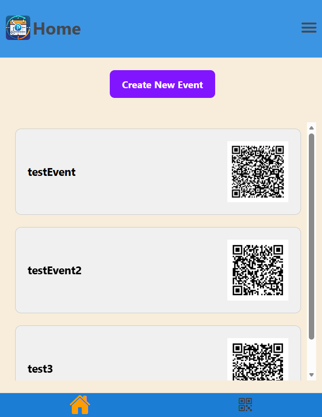
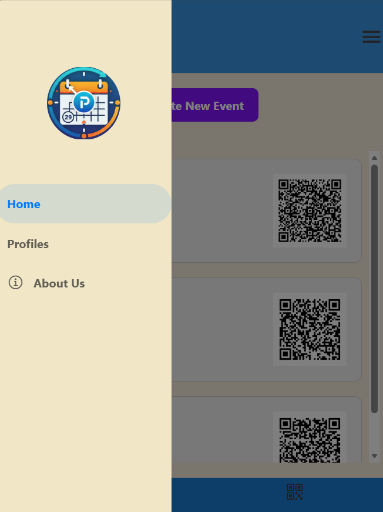
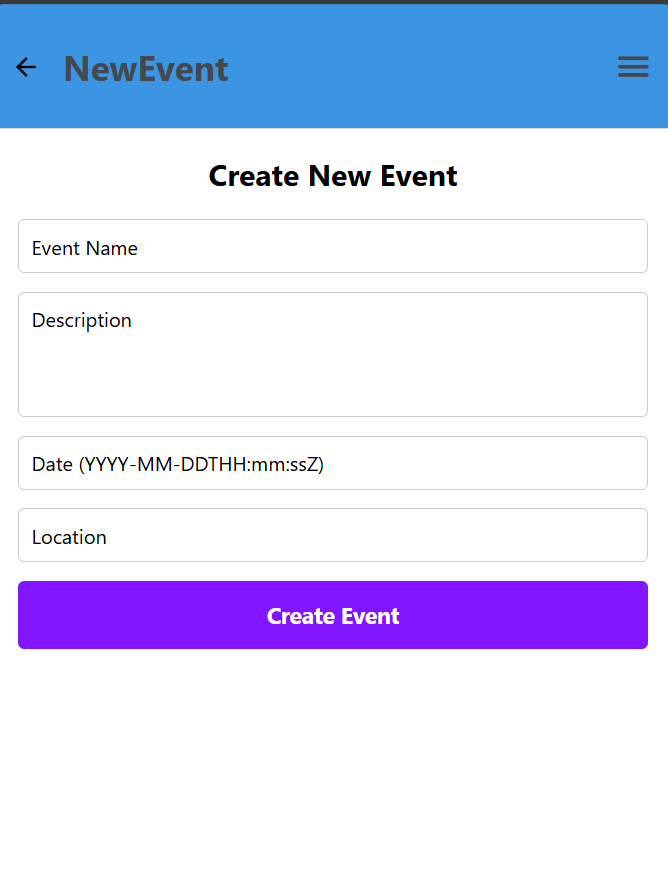

# Event Management System

**Event Management System** — a simple events app built with **React Native (Expo)** for the frontend and **Django + Django REST Framework (DRF)** for the backend. 🎟️📱

---

## Screenshots

> The images are stored in the `images/` folder in the project root. Referenced images:

- 
- 
- 

---

## Frontend (React Native)

- Created with Expo:
  - `npx create-expo-app eventManagementSystem --template blank`
- Navigation:
  - React Navigation core: `npm install @react-navigation/native` ✅
  - Stack Navigator: `npm install @react-navigation/stack`
    - plus: `npx expo install react-native-gesture-handler @react-native-masked-view/masked-view`
  - Drawer Navigation: `npm install @react-navigation/drawer`
    - plus: `npx expo install react-native-gesture-handler react-native-reanimated react-native-worklets`
  - Bottom Tabs: `npm install @react-navigation/bottom-tabs`
- UI & icons:
  - Expo vector icons: `npm i @expo/vector-icons`
- Barcode scanning:
  - `npx expo install expo-barcode-scanner`

Quick start (frontend):

```bash
cd eventManagementFrontend
npm install
expo start
```

---

## Backend (Django + DRF)

This project uses Django and Django REST Framework to provide API endpoints. Backend libraries used include:

- Pillow
- qrcode
- djangorestframework

Quick start (backend):

```bash
cd backend
python -m venv venv
venv\Scripts\activate    # Windows
pip install -r ../requirements.txt
python manage.py migrate
python manage.py runserver
```

---

## Files created here

- `README.md` — this file
- `LICENSE` — project license (MIT)
- `requirements.txt` — backend dependencies (same file used by `pip install -r requirements.txt`)

---

## License

This project is available under the MIT License — see the `LICENSE` file for details.

---

If you want, I can also add the `images/` folder and the three PNGs (`Home.png`, `Drawer.png`, `CreateEvent.png`) if you provide them or want placeholders generated.
